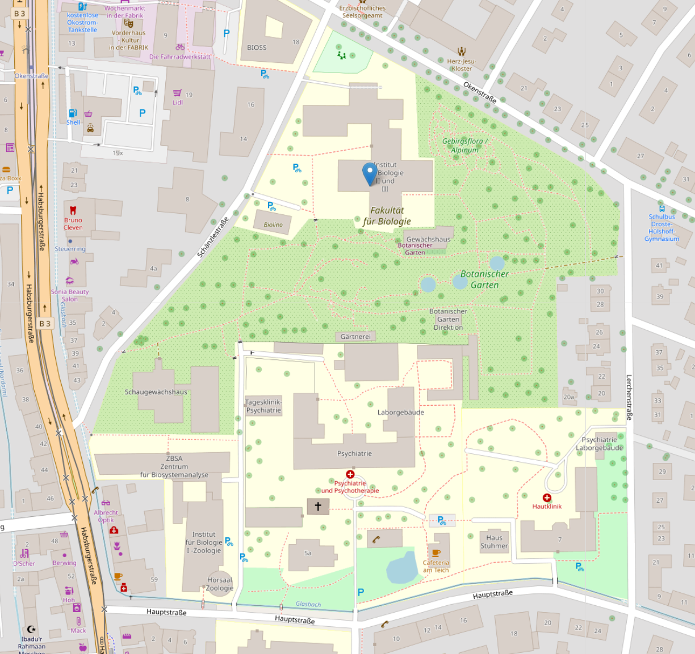

# Galaxy for linking bisulfite sequencing with RNA sequencing

The training course will introduce the [Galaxy framework](https://usegalaxy.org), and showcase its tools for data handling and preprocessing, differential gene expression analysis, bisulfite sequencing analysis, and Oxford Nanopore data exploration and usage.  
Lectures will be provided on the topics of RNA and Bisulfite sequencing, Epigenetics, and basic statistics, and followed by hands-on sessions. Finally, we will showcase a Galaxy Docker installation for customized workflow analysis.

Learning goals:
- Know your data, and the implications of data preprocessing and quality control
- Performing differential gene expression analysis using Galaxy
- Performing differential methylation analysis using Galaxy
- Handling and analyse Oxford Nanopore sequencing data

Prerequisites:
This workshop is intended for MSc/PhD students, postdocs, and researchers with a background in the Life Sciences. During registration, please hand over a poster about a research topic of your choosing. Posters will be presented during our poster session, which you can use to exchange experiences with other researchers.

<div id="top"></div>

- [Venue](#venue)
- [Schedule](#schedule)
  - [Day 1](#day-1---wednesday-6th-march)
  - [Day 2](#day-2---thursday-7th-march)
  - [Day 3](#day-3---friday-8th-march)
- [Run our Docker container](#run-our-docker-container)
- [Poster session](#poster-session)
- [Evening event](#evening-event)
- [Useful links](#useful-links)
- [Evaluation](#evaluation)

## Venue

All training sessions will be delivered at the Dep. of Biology, Schänzlestraße 1, 79104 Freiburg. The building can be reached using the Straßenbahn line **4**, stop: **Hauptstraße**. Please, refer to the [VAG](https://www.vag-freiburg.de/) public transportation page for timetables and directions. Once arrived, please follow the singns **de.NBI de.STAIR training** to reach the designated room.
[](https://www.openstreetmap.org/?mlat=48.00989&mlon=7.85747#map=17/48.01108/7.85693)
<br />
<p align="right"><a href="#top">&#x25B2; back to top</a></p>

## Schedule

### Day 1 - Wednesday 9th October

| **Time slot** | **Topic** | **Tutor** |
| :---: | :--- | :---: |
| 08:30 - 09:00 | Welcome and training course outline | Andrea Bagnacani |
| 09:00 - 10:40 | Lecture: RNA and Bisulfite sequencing techniques | Steve Hoffmann |
| 10:40 - 11:00 | Coffee break ||
| 11:00 - 11:45 | Lecture: Introduction to sequencing data analysis | Markus Wolfien |
| 11:45 - 12:30 | Hands-on: Introduction to Galaxy [(slides)](https://galaxyproject.github.io/training-material/topics/introduction/slides/introduction.html#1)| Andrea Bagnacani |
| 12:30 - 14:15 | Lunch ||
| 14:15 - 15:00 | Hands-on: Differential gene expression analysis - Quality control [(slides)](https://galaxyproject.github.io/training-material/topics/sequence-analysis/tutorials/quality-control/slides.html#1) [(hands-on)](https://galaxyproject.github.io/training-material/topics/sequence-analysis/tutorials/quality-control/tutorial.html)| Andrea Bagnacani |
| 15:00 - 15:45 | Hands-on: Differential gene expression analysis - Mapping [(hands-on)](https://galaxyproject.github.io/training-material/topics/sequence-analysis/tutorials/mapping/tutorial.html)| Markus Wolfien |
| 15:45 - 16:30 | Coffee break ||
| 16:30 - 17:15 | Hands-on: Differential gene expression analysis - Quantification [(data)](https://usegalaxy.eu/u/mwolfien/h/galaxy-training-rostock-quantification) [(hands-on)](https://galaxyproject.github.io/training-material/topics/transcriptomics/tutorials/ref-based/tutorial.html#analysis-of-the-differential-gene-expression)| Markus Wolfien |
| 17:15 - 18:00 | Hands-on: [Galaxy Modular Workflow Generator](https://github.com/destairdenbi/galaxy-modular-workflow-generator) | Andrea Bagnacani, Konstantin Riege |
| 18:00 | Dinner | [booking necessary](#evening-event) |

### Day 2 - Thursday 10th October

| **Time slot** | **Topic** | **Tutor** |
| :---: | :--- | :---: |
| 09:00 - 10:15 | Hands-on: Differential methylation analysis - Quality control | Konstantin Riege |
| 10:15 - 11:15 | Hands-on: Differential methylation analysis - Mapping | Konstantin Riege |
| 11:15 - 11:45 | Coffee Break ||
| 11:45 - 12:45 | Hands-on: Differential methylation analysis - Quantification | Konstantin Riege |
| 12:45 - 14:30 | Lunch ||
| 14:30 - 15:15 | Hands-on: Differential methylation analysis - Visualization | Konstantin Riege, Steve Hoffmann |
| 15:15 - 15:30 | Coffee Break ||
| 15:30 - 17:30 | Poster Session | [pitch presentations](#poster-session) |

### Day 3 - Friday 11th October

| **Time slot** | **Topic** | **Tutor** |
| :---: | :--- | :---: |
| 09:00 - 10:15 | Lecture: Epigenetics at the DNA level | Wolfgang Hess |
| 10:15 - 11:00 | Lecture: Third Generation Sequencing | Steffen C. Lott |
| 11:00 - 11:15 | Coffee Break ||
| 11:15 - 12:30 | Hands-on: Working with Nanopore sequencing data | Steffen C. Lott |
| 12:30 - 13:30 | Evaluation of the course + Discussion ||
<p align="right"><a href="#top">&#x25B2; back to top</a></p>

## Run our Docker container

To run Docker containers on our machines, type:
```
$ docker run -d -p 8080:80 quay.io/destair/galaxy-modular-workflow-generator:latest
```

After that, the Galaxy instance can be accessed in a web browser at:
```
localhost:8080
```
<p align="right"><a href="#top">&#x25B2; back to top</a></p>

## Poster session

The poster session will be held in the same room that we'll use throughout the whole 3 days training event. Bring a PDF version of your poster! We will show it using a projector.  
Please prepare a 5 minutes pitch presentation: every poster will be presented to the whole class.
<p align="right"><a href="#top">&#x25B2; back to top</a></p>

## Evening event

After the first day, we will dine at [Vorderhaus Restaurant](http://www.vorderhaus-restaurant.de/). Please tell us if you want to join during the registration.
<p align="right"><a href="#top">&#x25B2; back to top</a></p>

## Useful links
- [Galaxy training material](https://galaxyproject.github.io/training-material/): a collection of tutorials developed and maintained by the worldwide Galaxy community
- [QC FAIL](https://sequencing.qcfail.com/) : articles about common NGS problems
- [Correlation between DNA methylation and gene expression in the brains of patients with bipolar disorder and schizophrenia](https://doi.org/10.1111/bdi.12255)
- [A complex association between DNA methylation and gene expression in human placenta at first and third trimesters](https://doi.org/10.1371/journal.pone.0181155)
- [Correlation between the DNA methylation and gene expression of IGFBP5 in breast cancer](https://doi.org/10.3233/BD-160234)
- [DNA methylation changes in endometrium and correlation with gene expression during the transition from pre-receptive to receptive phase](https://doi.org/10.1038/s41598-017-03682-0)
<p align="right"><a href="#top">&#x25B2; back to top</a></p>

## Evaluation
As trainers, we care about providing a comprehensive learning pathway. How was it in your opinion? Please, [provide us your feedback through this short evaluation form](https://de.surveymonkey.com/r/denbi-course?sc=rbc&id=000183).
<p align="right"><a href="#top">&#x25B2; back to top</a></p>
