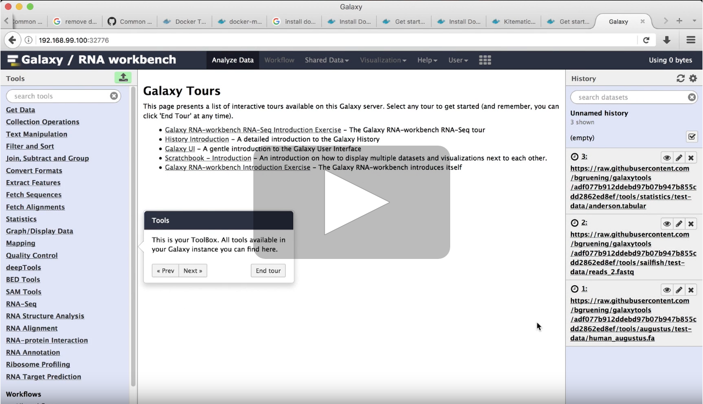
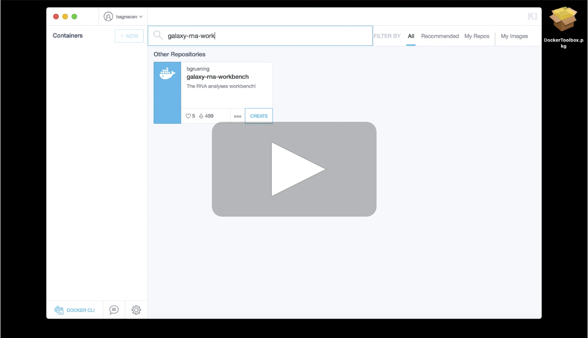
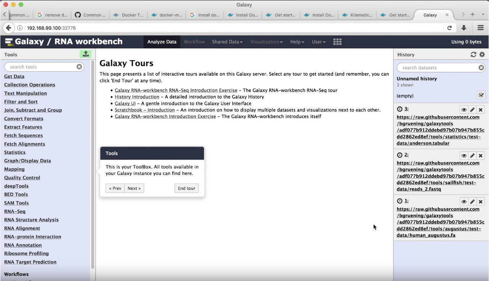

# Running the Galaxy RNA workbench Docker container using Kitematic

The [Galaxy RNA workbench](https://github.com/bgruening/galaxy-rna-workbench)
([Grüning et al. 2017](https://doi.org/10.1093/nar/gkx409),
[Fallmann et al. 2019](https://doi.org/10.1093/nar/gkz353)) is a
[Galaxy framework](https://galaxyproject.org/) which incorporates a
comprehensive set of tools and best-practice workflows for the analysis of RNA
data. This framework is available as an on-line web server, at
[https://rna.usegalaxy.eu](https://rna.usegalaxy.eu), or as a
[Docker](https://www.docker.com/) container at
[DockerHub](https://hub.docker.com/r/bgruening/galaxy-rna-workbench) and
[Quay.io](https://quay.io/repository/bgruening/galaxy-rna-workbench).

## Use case

In this tutorial, we want to set up our system in order to run the Galaxy RNA
workbench locally.  
To do so, the only requirement is Docker. However, Docker can be installed in
different ways depending on the underlying system:
- Unix users can follow the
[Docker installation for Linux](https://docs.docker.com/installation)
- MacOS 10.12+ users can follow the
[Docker installation for Mac](https://hub.docker.com/editions/community/docker-ce-desktop-mac)
- Windows 10+ users, can follow the
[Docker installation for Windows](https://hub.docker.com/editions/community/docker-ce-desktop-windows)

Here we show how to set up your system in the event that you are a non-unix
user, or in case your operative system version is older than any of the ones
mentioned above.  
Our solution relies on [Kitematic](https://kitematic.com/), which provides an
easy installation interface for both MacOSX and Windows systems.

## Solution

In the following tutorial we guide you through the steps to install Kitematic
on your system.  
The video shows the set up process on the MacOSX operative system, however,
Windows users can rely on the same procedure.

Now that Kitematic is set up, you can open it to browse the catalog of Docker
images available at DockerHub.  
To do so, you first need to register for free for a [DockerHub account](https://hub.docker.com/signup).  
Now that you have an account, you can browse the catalog of Docker images, and
run the Galaxy RNA workbench.

The Galaxy RNA workbench can now be used to analyse data.  
If you are not familiar with how the Galaxy interface is organized, how to
import data into Galaxy, and where to find the tools, you can run an
*interactive tour*.

